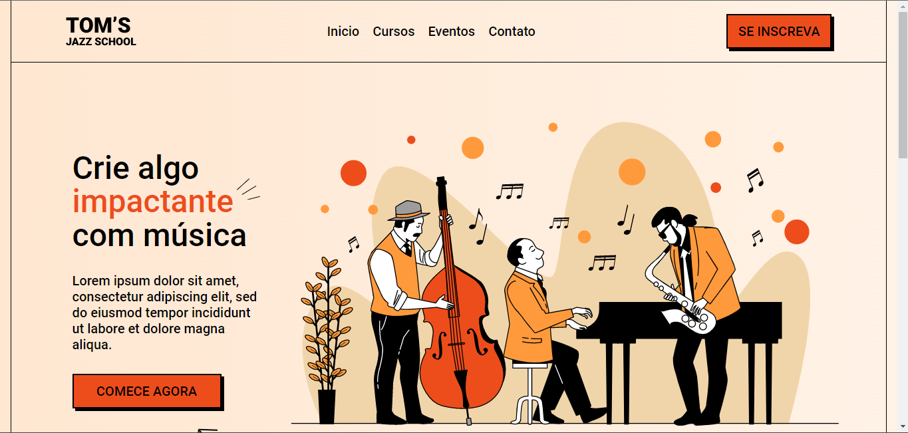

# Tom's Jazz School Landing Page

Este é o repositório do projeto da landing page do Tom's Jazz School. Esta página é desenvolvida em HTML e CSS e tem como objetivo fornecer informações sobre a escola de jazz, seus cursos, professores e como entrar em contato.

Você pode visualizar a landing page em [https://tom-s-jazz-school-aeo55d2ha-rafaelfaust.vercel.app/](https://tom-s-jazz-school-aeo55d2ha-rafaelfaust.vercel.app/).



## Pré-requisitos

Antes de iniciar, você precisará ter os seguintes itens instalados em sua máquina:

- Um editor de texto para escrever o código, como o Visual Studio Code, Sublime Text ou Atom.
- Um navegador web atualizado, como o Google Chrome, Mozilla Firefox ou Safari.

## Instruções de instalação

1. Clone este repositório em sua máquina local utilizando o seguinte comando no terminal:

   ```shell
   git clone https://github.com/rafaelfaust/Tom-s-Jazz-School.git
   ```

2. Navegue até o diretório do projeto:

   ```shell
   cd Tom-s-Jazz-School
   ```

3. Abra o arquivo `index.html` em seu navegador web ou utilize um servidor local para executar o projeto.

## Estrutura do projeto

O projeto possui a seguinte estrutura de arquivos:

```
Tom-s-Jazz-School/
├── css/
│   └── style.css
├── img/
│   ├── logo.png
│   └── background.jpg
├── index.html
└── README.md
```

- A pasta `css/` contém o arquivo `style.css`, que é responsável pela estilização da página.
- A pasta `img/` armazena as imagens utilizadas na página, como o logotipo e o plano de fundo.
- O arquivo `index.html` é a página principal da landpage, onde o conteúdo é estruturado e estilizado.
- O arquivo `README.md` é o arquivo que você está lendo agora, que fornece informações sobre o projeto.

## Personalização

Você pode personalizar a landpage conforme suas necessidades. Aqui estão algumas áreas que você pode considerar alterar:

- **Logo**: Substitua o arquivo `logo.png` na pasta `img/` por sua própria imagem de logotipo.
- **Imagem de fundo**: Substitua o arquivo `background.jpg` na pasta `img/` por sua própria imagem de plano de fundo.
- **Conteúdo**: Edite o arquivo `index.html` para adicionar, modificar ou remover o conteúdo da landpage. Você pode adicionar informações sobre os cursos, professores, eventos, etc.

## Contribuição

Contribuições são bem-vindas! Se você encontrar algum problema ou tiver sugestões de melhorias, sinta-se à vontade para abrir uma nova issue neste repositório ou enviar um pull request.

## Licença

Este projeto está licenciado sob a licença [MIT](LICENSE). Sinta-se livre para usar, modificar e distribuir o código conforme necessário.

## Contato

Se você tiver alguma dúvida ou precisar entrar em contato, pode me encontrar em:

- [GitHub](https://github.com/rafaelfaust)
- [Website](https://www.rafaelfaust.com.br)

Espero que este projeto seja útil para você. Divirta-se personalizando-o e desenvolvendo sua landing page para a Tom's Jazz School!
